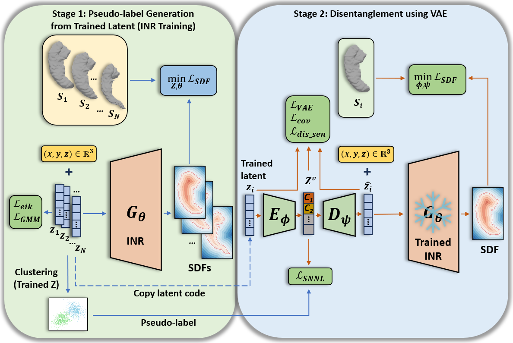
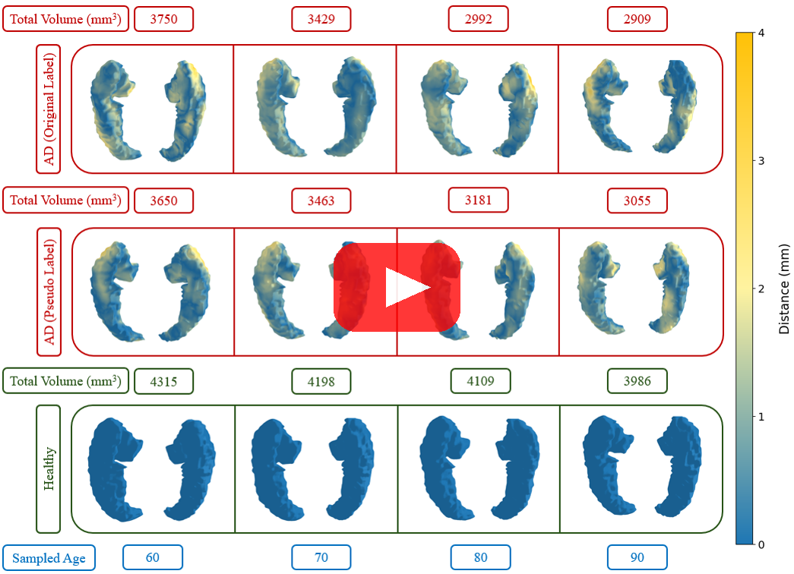
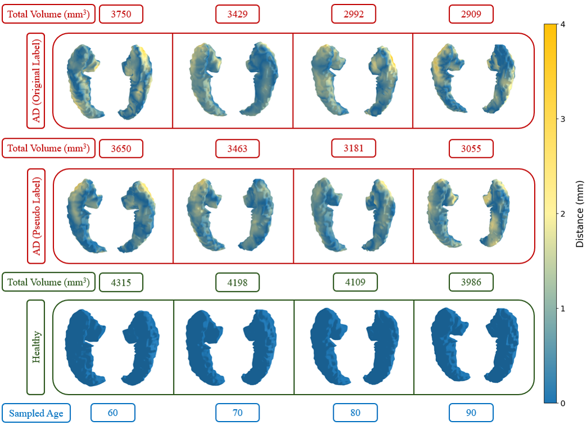
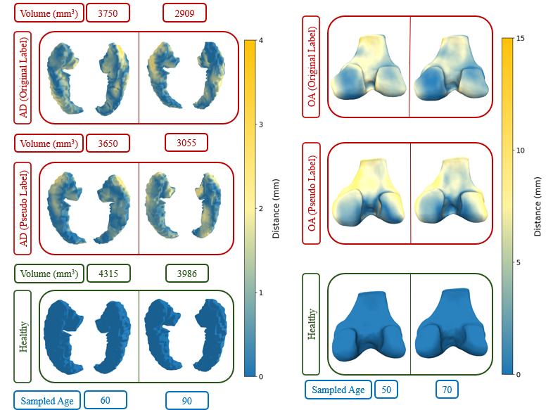

# Self-supervised Disentanglement in Medical Shapes

DeepSDF-based pipeline for learning an SDF auto-decoder and a second-stage MLP‑VAE over latent codes.

<table>
  <tr>
    <td align="left">
      
      <br />
      <em>Overall Architecture.</em>
    </td>
    <td align="left">
      <a href="https://www.youtube.com/watch?v=XdiVVx-Hpyw" target="_blank" rel="noopener noreferrer">
        
      </a>
      <br />
      <em>Interpolation Visualization Video.</em>
    </td>
  </tr>
  <tr>
    <td align="left">
      
      <br />
      <em>Hippocampus Interpolation and Generation.</em>
    </td>
    <td align="left">
      
      <br />
      <em>Hippocampus and Femur Interpolation and Generation.</em>
    </td>
  </tr>
</table>

## Overview

1. Preprocess meshes into SDF samples.
2. Stage 1: Train the SDF auto-decoder.
3. Stage 2: Train the MLP‑VAE on Stage 1 latent codes.

## File Organization

The scripts assume a shared organizational structure so that outputs from one step can be used by later steps.

### Data Layout

This folder holds the unified SDF and surface samples after preprocessing. Split files point to subsets of these samples for training and evaluation.

<details>
<summary>Data Layout (expand)</summary>
<pre><code>&lt;data_source_name&gt;/
    .datasources.json
    SdfSamples/
        &lt;dataset_name&gt;/
            &lt;class_name&gt;/
                &lt;instance_name&gt;.npz
    SurfaceSamples/
        &lt;dataset_name&gt;/
            &lt;class_name&gt;/
                &lt;instance_name&gt;.ply
</code></pre>
</details>

Split files (JSON) define subsets of the unified data source. See `examples/splits/`.

The file `datasources.json` stores a mapping from dataset names to paths. If data is moved, update this file accordingly.

### Experiment Layout

Each experiment directory is self-contained: specs + checkpoints + reconstructions + TensorBoard outputs. Stage 2 (MLP‑VAE) reads latent codes produced by Stage 1.

<details>
<summary>Experiment Layout (expand)</summary>
<pre><code>&lt;experiment_name&gt;/
    specs.json
    Logs.pth
    LatentCodes/
        &lt;Epoch&gt;.pth
    ModelParameters/
        &lt;Epoch&gt;.pth
    OptimizerParameters/
        &lt;Epoch&gt;.pth
    Reconstructions/
        &lt;Epoch&gt;/
            Codes/
                &lt;MeshId&gt;.pth
            Meshes/
                &lt;MeshId&gt;.pth
    TensorBoard/
        ReconstructionsTrain/
            &lt;classID_shapeID&gt;/
                &lt;epoch=Epoch&gt;.ply
        ReconstructionsTest/
            &lt;classID_shapeID&gt;/
                &lt;epoch=Epoch&gt;.ply
        TensorBoardLogFile
</code></pre>
</details>

The only file required to begin an experiment is `specs.json`, which sets parameters, architecture, and data paths.

## Preprocessing

The preprocessing code is in C++ and requires:

- CLI11
- Pangolin
- nanoflann
- Eigen3

Build:

```
mkdir build
cd build
cmake ..
make -j
```

Headless rendering (optional):

```
export PANGOLIN_WINDOW_URI=headless://
```

Preprocess SDF samples:

```
python preprocess_data.py --data_dir [path to sdf data folder] --source [path to mesh dataset folder] --name <dataset_name> --split examples/splits/<split>.json --skip
```

This generates `.npz` SDF samples under `SdfSamples/` using the specified split. Keep `datasources.json` consistent with your data paths.

Preprocess surface samples (for evaluation):

```
python preprocess_data.py --data_dir [path to sdf data folder] --source [path to mesh dataset folder] --name <dataset_name> --split examples/splits/<split>.json --surface --skip
```

Surface samples are used only for evaluation metrics and visualization, not for SDF training.

Generate mesh `.ply` files from segmentation files:

- [`utils/batch_process_to_ply.py`](utils/batch_process_to_ply.py) converts segmentation files into mesh `.ply` outputs in batch.

## Training

Stage 1: Train SDF auto-decoder:

```
python train_deep_sdf.py -e examples/<experiment_folder>
```

Stage 2: Train MLP‑VAE on latent codes:

```
python train_MLP_VAE_deep_sdf.py -e examples/<experiment_folder>
```

Run Stage 1 first to produce latent codes, then Stage 2 to learn the disentangled latent model.

To resume training:

```
python train_deep_sdf.py -e examples/<experiment_folder> --continue <epoch>
```

Visualization notebooks (run after training):

- Stage 1 latent space visualization: [run_HLLE_ICA_latent_space.ipynb](run_HLLE_ICA_latent_space.ipynb)
- Stage 2 latent-to-shape visualization: [interactive_visualization_latent_to_shape.ipynb](interactive_visualization_latent_to_shape.ipynb)

## Training Checkpoints

Saved checkpoints for Stage 1 and Stage 2 (latent codes, model parameters, optimizer parameters):

- [Google Drive folder](https://drive.google.com/drive/folders/126Qa6eJAueuNJF_lj259ABY0bZjAP1_V?usp=drive_link)

## Reconstruction

```
python reconstruct.py -e examples/<experiment_folder> -c <epoch> --split examples/splits/<split>.json -d [path to sdf data folder] --skip
```

Reconstruction uses a trained checkpoint to produce meshes for the split.

## Evaluation

```
python evaluate.py -e examples/<experiment_folder> -c <epoch> -d [path to sdf data folder] -s examples/splits/<split>.json
```

Evaluation compares reconstructions against surface samples from the same split.
